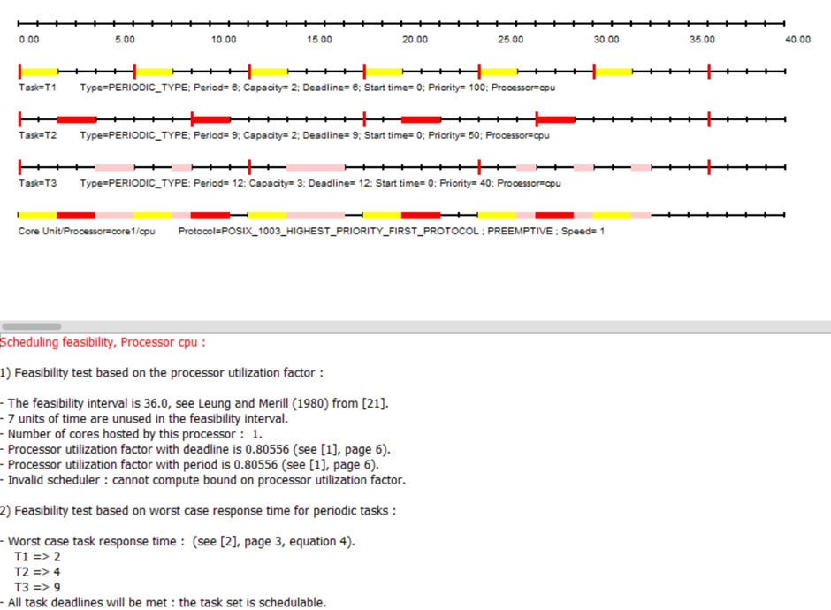
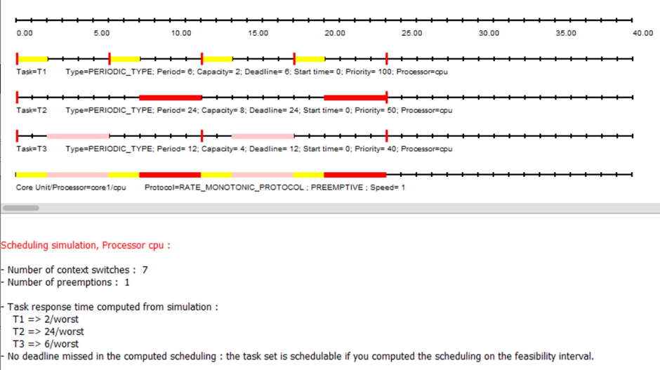
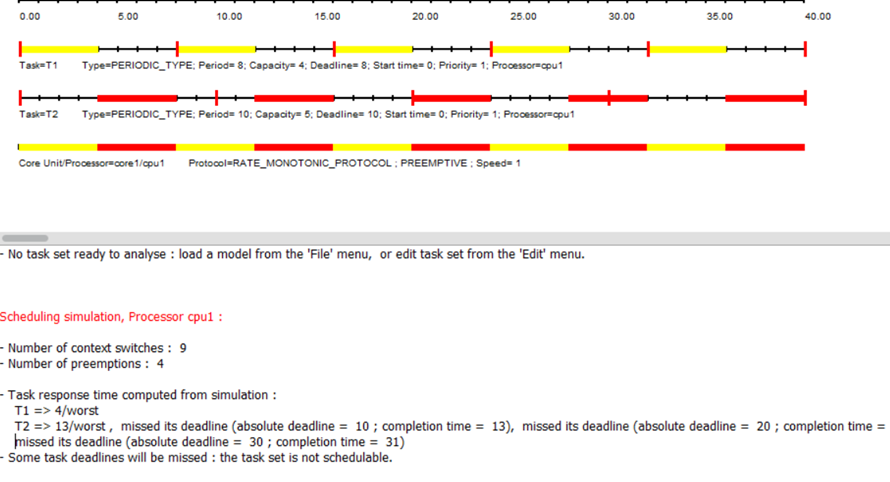
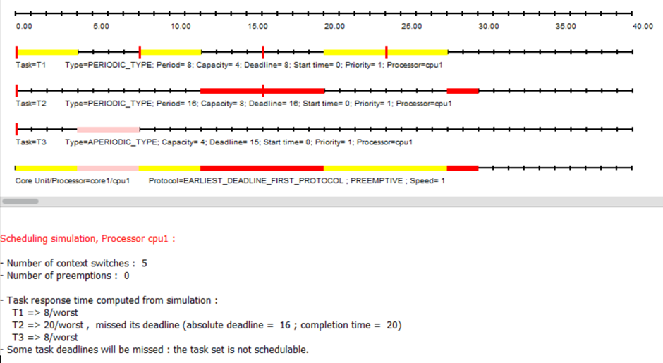
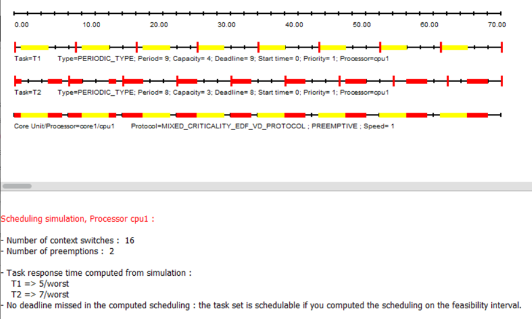
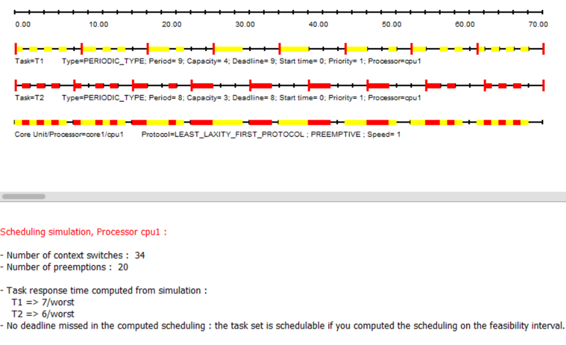
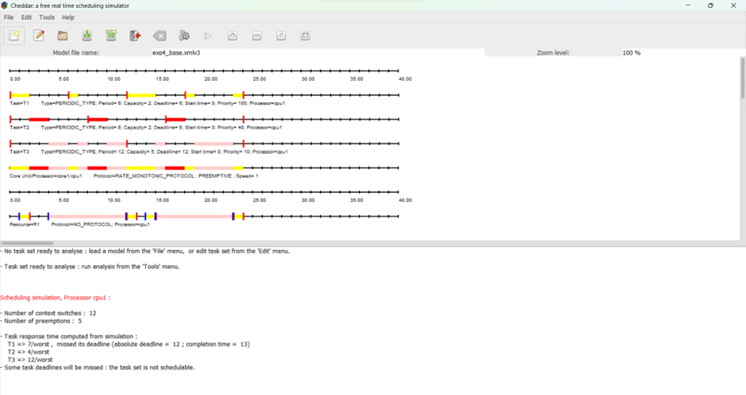

<h1 align="center"> 🖊Relatório 01📃 </h1>

<h3 align="center">
Relatório 01 - Escalonamento com Cheddar
</h3>

## 💻 Resolução

### Exercício 1

1-

2 - Sim, é possível ver variação, pois o método utilizado utiliza prioridade e isso aumenta as chances de variação pois uma tarefa pode interferir na execução da outra dependendo da prioridade de cada uma. O menor tempo de resposta ocorrerá quando a task mais rápida de ser executada for completa sem interrupções, dessa forma ela não ficará incompleta ou não será pausada e terminará no menor tempo possível.

5-

Desta vez não houve perdas.

### Exercício 2

5-

Em T3 pois é interrompido pelo ciclo de T2. No tempo 8 por exemplo inicia mais um ciclo de T2 porém no instante 10 precisa iniciar o T3 e há esse choque pois T2 é finalizado primeiro e após seu término, T3 é executado.

7-

Dessa vez a tarefa T1 não interfere como no exemplo anterior, T1 é executada 1 tempo após o período padrão definido, dando assim espaço para T3 ser finalizada. Mas no tempo 31 ainda ocorre interrupção e aí ocorre o pior tempo e novamente em T3 pois demora mais do que o seu período definido para terminar seu ciclo.

10-

Sim, T1 e T2 se chocaram, ambos começam um novo ciclo em 16, fazendo com o que haja perdas.

### Exercício 3

4-

5- No primeiro e no segundo ciclo de T2, pois há interrupções na execução de T2 porque dá prioridade a T1 e faz com o que termine a execução de T2 tardiamente. Há choques entre as tasks que atrapalham o prazo da task T2.

7-

Os piores momentos são aqueles mais fragmentado e distante uns dos outros, em T2 o ciclo 2 é o pior e em T1 o antepenúltimo e último ciclo são os piores. Nesse método não ocorre perdas, as tasks estão bem divindades e encaixadas.

8- Pode-se concluir que dependendo do método utilizado para o escalonamento, vários resultados são obtidos, no ex1 as tasks não são fragmentadas e no ex2 são e dessa forma há uma atenção melhor dividida entre as tarefas. Ambas possuem os mesmos períodos em que não executam nenhuma task mas enquanto o último exemplo divide as tarefas em várias partes e processa de forma fragmentada, o primeiro não executa assim.

10- Depende, considerando que temos prioridades iguais para ambas as tarefas, a segunda política divide melhor a atenção entre as tarefas e conclui ambas em tempos parecidos.

### Exercício 4

4-

6- Bloqueados: Períodos 0; 3; 11; 13; 14;21. Desbloqueados: Períodos 1; 12; 14; 22.

9- Em alguns processos, as tasks são fragmentadas, causando uma desordem maior, isto pelas interrupções nos períodos discrepantes, mudando a prioridades de ambas, assim como no período 15.

10- Nos períodos 7, 11,12, 13, 15.

11- Todos os piores casos foram mudados em todas as tasks em execução.

12- tempos de bloqueios foram 1, 4, 9, 12, 14, 22.

## 🔖 Mais

Você pode visualizar a resolução também através do docs online [clicando aqui](https://docs.google.com/document/d/1pNUDFvo3kUBGwB1fFtYgwH9d-5wE11e_n3xG1nm0N1o/edit?usp=sharing).

## :memo: Licença

Esse projeto está sob a licença MIT.

Feito com ♥ by Camila Fontes, Marlysson Dantas, Vinícius Lima, Laila Esterfane e Miguel Ferreira.
